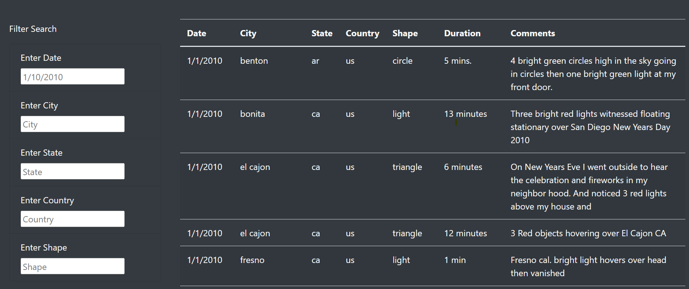
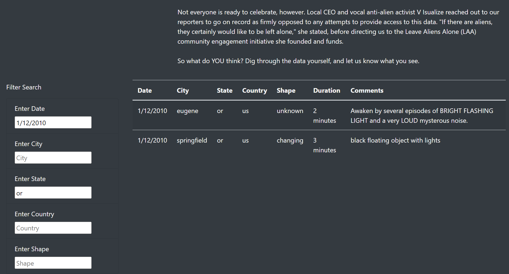
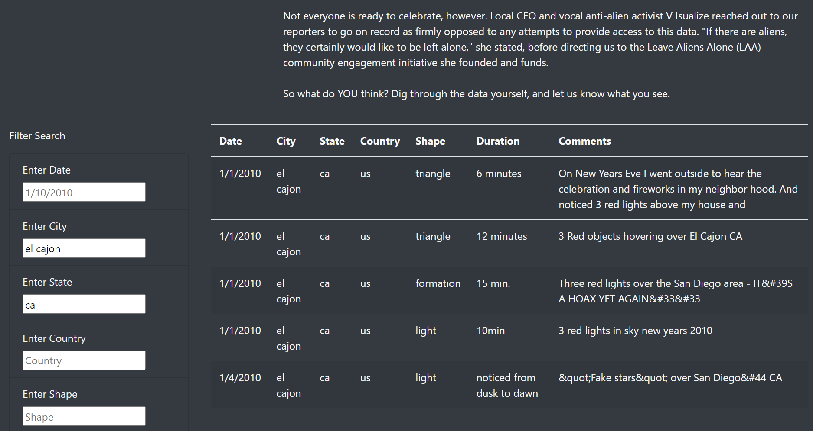

# UFOs
Module 12 Analysis
## Overview of Project
Analysis of UFO sightings by allowing users to filter for multiple criteria at the same time.
## Purpose
Create a webpage and dynamic table to organize UFO data stored as a JavaScript array and place table into an HTML file for easy viewing.

## Results
The following table will display the results of UFO sightings with the following information: 
-	Date of sighting
-	City
-	State
-	Country
-	Shape
-	Duration
-	Comments

In order to filter the data, user may enter any of these fields to pull the data on the table. Your results will get more specific as fields are added.
For example, the following search will show results for UFO sightings in Oregon for date 1/12/2010. 

The following will show all UFO sightings in El Cajon, CA. The results show a total of 5 sightings on two different dates. 

## Summary
One drawback of this webpage is that you can’t filter the results in alphabetical order for further analyzation. To better understand a pattern in UFO sightings, coordinates and time of day should be added to the data. By adding filters to each column, you are able to find more patterns to find state where more sightings are recorded. You can also find the longest and shortest sighting. There would be more possibilities to find patterns in the data provided.
